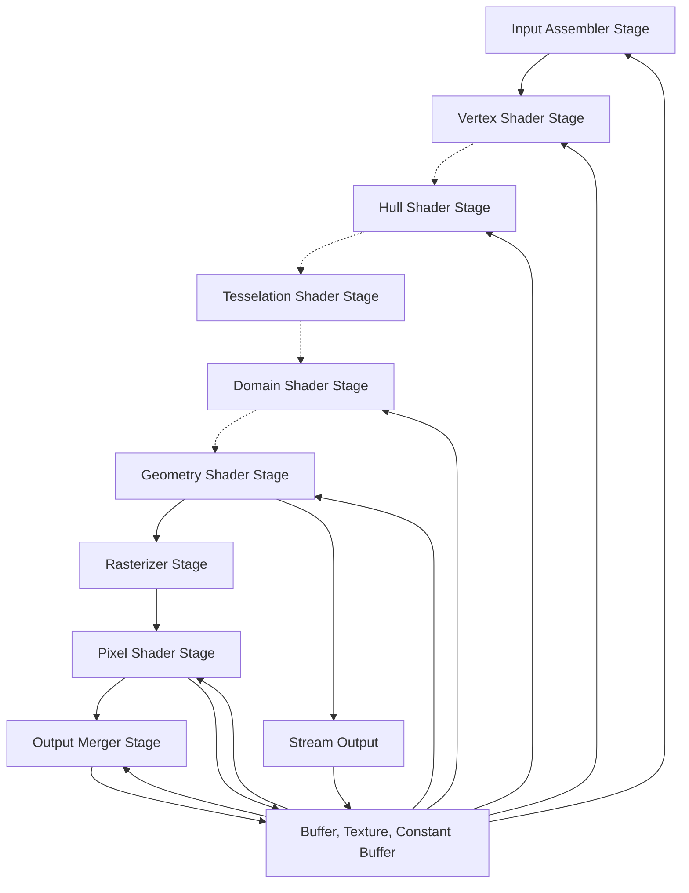

# Hello D3D11

We setup a base application in the former chapter. I wont be showing `Main.cpp` and `Application.cpp` anymore.

Let's break down the relevant bits and pieces by showing you how the new class, which derives from `Application` will look like.

## HelloD3D11.hpp

```cpp
#include <dxgi.h>
#include <d3d11.h>
#include <wrl.h>

#include "Application.hpp"

#include <string_view>

class HelloD3D11Application final : public Application
{
    template <typename T>
    using ComPtr = Microsoft::WRL::ComPtr<T>;
public:
    HelloD3D11Application(const std::string_view title);
    ~HelloD3D11Application() override;

protected:
    bool Initialize() override;
    void OnResize(
        const int32_t width,
        const int32_t height) override;
    void Update() override;
    void Render() override;
private:
    bool CreateSwapchainResources();
    void DestroySwapchainResources();

    ComPtr<ID3D11Device> _device = nullptr;
    ComPtr<ID3D11DeviceContext> _deviceContext = nullptr;
    ComPtr<IDXGIFactory1> _dxgiFactory = nullptr;
    ComPtr<IDXGISwapChain> _swapChain = nullptr;
    ComPtr<ID3D11RenderTargetView> _renderTarget = nullptr;
};
```

## HelloD3D11.cpp

And the implementation side

```cpp
#include "HelloD3D11.hpp"

#include <GLFW/glfw3.h>
#define GLFW_EXPOSE_NATIVE_WIN32
#include <GLFW/glfw3native.h>

#include <d3dcompiler.h>
#include <DirectXMath.h>

#include <iostream>

#pragma comment(lib, "d3d11.lib")
#pragma comment(lib, "dxgi.lib")
#pragma comment(lib, "d3dcompiler.lib")
#pragma comment(lib, "winmm.lib")
#pragma comment(lib, "dxguid.lib")

HelloD3D11Application::HelloD3D11Application(const std::string_view title)
    : Application(title)
{
}

HelloD3D11Application::~HelloD3D11Application()
{
}

bool HelloD3D11Application::Initialize()
{
}

bool HelloD3D11Application::CreateSwapchainResources()
{
}

void HelloD3D11Application::DestroySwapchainResources()
{
}

void HelloD3D11Application::OnResize(
    const int32_t width,
    const int32_t height)
{
}

void HelloD3D11Application::Update()
{
}

void HelloD3D11Application::Render()
{
}
```

```cpp
#include <GLFW/glfw3.h>
#define GLFW_EXPOSE_NATIVE_WIN32
#include <GLFW/glfw3native.h>

#include <d3dcompiler.h>
#include <DirectXMath.h>
```

We need to include the following headers, here's what each of these headers includes:

- `d3d11.h`: The core of D3D11, it contains all the ID3D11XXX types and most of the enums we will be using with D3D11
- `dxgi.h`: The core of DXGI, it contains all the IDXGIXXX types and additional enums that are required for DXGI structures
- `d3dcompiler.h`: Contains all the functions necessary to compiler our HLSL shaders into bytecode that will be fed into the GPU
- `DirectXMath.h`: DirectX's own math library, it contains all the types and math functions we will be using throughout the series
- `wrl.h`: Is used for `Microsoft::WRL::ComPtr<T>`, to manage COM resources automatically.
```cpp
#pragma comment(lib, "d3d11.lib")
#pragma comment(lib, "dxgi.lib")
#pragma comment(lib, "d3dcompiler.lib")
#pragma comment(lib, "winmm.lib")
#pragma comment(lib, "dxguid.lib")
```

Of course just including the headers isn't enough, we must also link against D3D11 & friends to be able to actually use the stuff declared in the headers, put these `#pragma` in `HelloD3D11.cpp` right below the includes.

```cpp
template <typename T>
using ComPtr = Microsoft::WRL::ComPtr<T>;
```

Since the namespace name for ComPtr<T> is quite long, we are making a type alias like this.

```cpp
ComPtr<IDXGIFactory1> _dxgiFactory = nullptr;
ComPtr<ID3D11Device> _device = nullptr;
ComPtr<ID3D11DeviceContext> _deviceContext = nullptr;
ComPtr<IDXGISwapChain> _swapChain = nullptr;
ComPtr<ID3D11RenderTargetView> _renderTarget = nullptr;
```

You might have noticed that we are not using raw pointers for those pieces, but `ComPtr`. DirectX is built on top of COM ([Component Object Model](https://en.wikipedia.org/wiki/Component_Object_Model)) and with that COM objects utilize reference counting to manage object lifetimes, in form of `AddRef` and `Release` methods. `ComPtr<T>` wraps that functionlity for us, by creating a smart pointer. You can find more information about it [here](https://docs.microsoft.com/en-us/cpp/cppcx/wrl/comptr-class?view=msvc-170).

`IDXGIFactory1` helps us find an adapter we can use to run our graphics on. It can enumerate all existing adapters (GPUs), of which there could be several installed in your system. If you have a laptop there is most likely an integrated one coming with your cpu, but often these days laptops also have a dedicated GPU as well, or your PC might have more than one dedicated GPUs installed. With `IDXGIFactory1` we can pick one. It also creates the swapchain for us, a surface to store rendered data before presenting it to an output (or screen).

`ID3D11Device` is the object which we use to create all sorts of things, buffers, textures, samplers, shaders.

`ID3D11DeviceContext` is the one we use to issue draw and compute commands to the GPU.

`IDXGISwapChain` The aforementioned surface, which stores rendered data which it can present to an output (or screen).

`ID3D11RenderTargetView` Is a fancy pointer to a texture, this tells D3D11 that the texture this points to, is drawable within the subresource of the referenced texture

`DXGI` stands for DirectX Graphics Infrastructure, in case you are wondering.

Lets go in to `Initialize`

```cpp
if (!Application::Initialize())
{
    return false;
}

if (FAILED(CreateDXGIFactory1(
    __uuidof(IDXGIFactory1),
    &_dxgiFactory)))
{
    std::cout << "DXGI: Unable to create DXGIFactory\n";
    return false;
}
```

The first part calls the parent class, where `GLFW` is initialized and setup.

[`CreateDXGIFactory1`](https://docs.microsoft.com/en-us/windows/win32/api/dxgi/nf-dxgi-createdxgifactory1) is the entry point to create a factory for us. a `IDXGIFactory1` to e precise. There are various implementations of it, depending on what version you aim for, you get additional functionality.

DXGI 1.0 up to 1.6 More information can be found [here](https://docs.microsoft.com/en-us/windows/win32/api/_direct3ddxgi/) We will stick with `IDXGIFactory1` for now.

```cpp
constexpr D3D_FEATURE_LEVEL deviceFeatureLevel = D3D_FEATURE_LEVEL::D3D_FEATURE_LEVEL_11_0;
UINT deviceFlags = D3D11_CREATE_DEVICE_FLAG::D3D11_CREATE_DEVICE_BGRA_SUPPORT;
if (FAILED(D3D11CreateDevice(
    nullptr,
    D3D_DRIVER_TYPE::D3D_DRIVER_TYPE_HARDWARE,
    nullptr,
    deviceFlags,
    &deviceFeatureLevel,
    1,
    D3D11_SDK_VERSION,
    &_device,
    nullptr,
    &_deviceContext)))
{
    std::cout << "D3D11: Failed to create Device and Device Context\n";
    return false;
}
```

This block is the the entry point into D3D11, where we ask for a device and its device context to be created. The input parameters are:

We want a LEVEL_11_0, hardware accelerated device, which has support for a specific color format.
Feature levels are a concept that has been introduced with D3D11, it is a way to specify which set of features we would like to use. Each GPU may support different feature levels (for example a very old GPU might only support LEVEL_9_1, while a more modern one may support every feature level up to, and including LEVEL_11_0), this is a way to avoid rewriting our application in D3D9 just because our GPU doesn't support D3D11.

If [`D3D11CreateDevice`](https://docs.microsoft.com/en-us/windows/win32/api/d3d11/nf-d3d11-d3d11createdevice) succeeds we will get a `ID3D11Device` and a `ID3D11DeviceContext` back.

```cpp
DXGI_SWAP_CHAIN_DESC swapchainInfo = {};
swapchainInfo.BufferDesc.Width = GetWindowWidth();
swapchainInfo.BufferDesc.Height = GetWindowHeight();
swapchainInfo.BufferDesc.RefreshRate.Numerator = 0;
swapchainInfo.BufferDesc.RefreshRate.Denominator = 1;
swapchainInfo.BufferDesc.Format = DXGI_FORMAT::DXGI_FORMAT_B8G8R8A8_UNORM;
swapchainInfo.BufferDesc.ScanlineOrdering = DXGI_MODE_SCANLINE_ORDER::DXGI_MODE_SCANLINE_ORDER_UNSPECIFIED;
swapchainInfo.BufferDesc.Scaling = DXGI_MODE_SCALING::DXGI_MODE_SCALING_STRETCHED;
swapchainInfo.SampleDesc.Count = 1;
swapchainInfo.SampleDesc.Quality = 0;
swapchainInfo.BufferUsage = DXGI_USAGE_RENDER_TARGET_OUTPUT;
swapchainInfo.BufferCount = 2;
swapchainInfo.OutputWindow = glfwGetWin32Window(GetWindow());
swapchainInfo.Windowed = true;
swapchainInfo.SwapEffect = DXGI_SWAP_EFFECT::DXGI_SWAP_EFFECT_FLIP_DISCARD;
swapchainInfo.Flags = {};

if (FAILED(_dxgiFactory->CreateSwapChain(
    _device.Get(),
    &swapchainInfo,
    &_swapChain)))
{
    std::cout << "DXGI: Failed to create SwapChain\n";
    return false;
}
```

After we successfully create device and device context, the next step is to create a swapchain, that storage containing the rendered images which we can present to the screen.

The majority of values should make some sense without explanation, like width and height, and whether we want it to support a windowed window or not.

Its usage is also meant to be a render target output, something we render to, and can present. The format here is in BGRA order, like the device creation flag we specified earlier, if you remember.

`BufferCount` is 2, because we want double buffering. Double buffering is an age-old technique to avoid presenting an image that is being used by the GPU, instead we work on the "back buffer", while the GPU is happy presenting the "front buffer", then, as soon as we are done with the back buffer, we swap front and back, and begin working on the former front buffer present that one and render to the other one again in the meantime. That process is supposed to reduce flicker or tearing

!!! error "Explain Refresh Rate?"

!!! error "Explain flip model - Link to Steven Toub's flip model?"

```cpp
if (!CreateSwapchainResources())
{
    return false;
}

return true;
```

And the last bits of the `Initialize` method.

We need to create a few more things. Those are based on the swapchain, hence their name. These resources need to be destroyed and recreated whenever we want to resize the window. When that happens, the swapchain needs to be resized as well (since that is a prameter in its descriptor as you can see above)

```cpp
bool HelloD3D11Application::CreateSwapchainResources()
{
    ComPtr<ID3D11Texture2D> backBuffer = nullptr;
    if (FAILED(_swapChain->GetBuffer(
        0,
        __uuidof(ID3D11Texture2D),
        &backBuffer)))
    {
        std::cout << "D3D11: Failed to get Back Buffer from the SwapChain\n";
        return false;
    }

    if (FAILED(_device->CreateRenderTargetView(
        backBuffer.Get(),
        nullptr,
        &_renderTarget)))
    {
        std::cout << "D3D11: Failed to create RTV from Back Buffer\n";
        return false;
    }

    return true;
}
```

When we render things we render to a buffer, or texture to be exact, which you can picture as a buffer which holds color information. Swapchain is a container to manage those buffers we want to present on screen.

Since we want to render into one of them, we need to grab the texture from the swapchain's main buffer (index 0), from that texture we also want to create a RenderTargetView (or RTV for short), which specifies the subresource of the texture that we will be drawing to. We wont keep the actual texture around, we just need the render target view, which we will refer to as render target.

```cpp
void HelloD3D11Application::DestroySwapchainResources()
{
    _renderTarget.Reset();
}
```

The render target needs to be disposed when we want to resize (or cleanup in general), it will be recreated via `CreateSwapchainResources` when we resize the window as shown here:

```cpp
void HelloD3D11Application::OnResize(
    const int32_t width,
    const int32_t height)
{
    Application::OnResize(width, height);
    _deviceContext->Flush();

    DestroySwapchainResources();

    if (FAILED(_swapChain->ResizeBuffers(
        0,
        width,
        height,
        DXGI_FORMAT::DXGI_FORMAT_B8G8R8A8_UNORM,
        0)))
    {
        std::cout << "D3D11: Failed to recreate SwapChain buffers\n";
        return;
    }

    CreateSwapchainResources();
}
```

When we resize, let the base application know about it, and make sure
the device context has done all its work ([`Flush`](https://docs.microsoft.com/en-us/windows/win32/api/d3d11/nf-d3d11-id3d11devicecontext-flush))

Before we can resize the swapchain, make sure all resources based on it are disposed. Afterwards recreate them with the new dimensions of the swapchain

```cpp
void HelloD3D11Application::Render()
{
    D3D11_VIEWPORT viewport = {};
    viewport.TopLeftX = 0;
    viewport.TopLeftY = 0;
    viewport.Width = GetWindowWidth();
    viewport.Height = GetWindowHeight();
    viewport.MinDepth = 0.0f;
    viewport.MaxDepth = 1.0f;

    constexpr float clearColor[] = { 0.1f, 0.1f, 0.1f, 1.0f };

    _deviceContext->ClearRenderTargetView(
        _renderTarget.Get(),
        clearColor);
    _deviceContext->RSSetViewports(
        1,
        &viewport);
    _deviceContext->OMSetRenderTargets(
        1,
        _renderTarget.GetAddressOf(),
        nullptr);
    _swapChain->Present(1, 0);
}
```

Now we can actually use those things we have created before.
We just set it up so that we tell `D3D11` that we want to render into the render target, and when we clear we want to use a dark gray.

We also have to specify an area in form of a rectangle, in this case, its equivalent to the window size.

Last but not least, we Present the content of the swapchain to the window, using [`Present`](https://docs.microsoft.com/en-us/windows/win32/api/dxgi/nf-dxgi-idxgiswapchain-present).

`Application` also defines an abstract method `Update` which we have to define here as well, so we will add:

```cpp
void HelloD3D11Application::Update()
{
}
```

But keep it empty for now.

## Abstraction into Application & D3D11Context

## Graphics Pipeline

!!! error "explain in an overview fashion with pics what directx pipeline is"

    how it roughly works and what it means and can do




