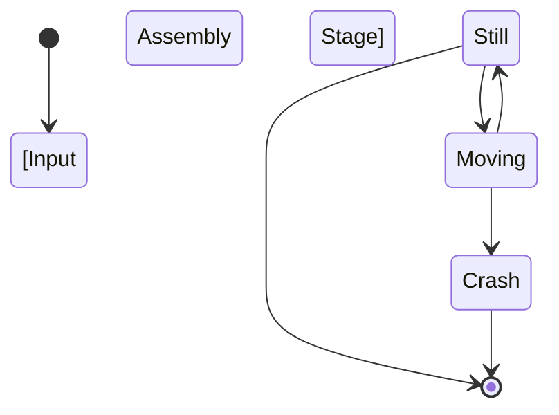
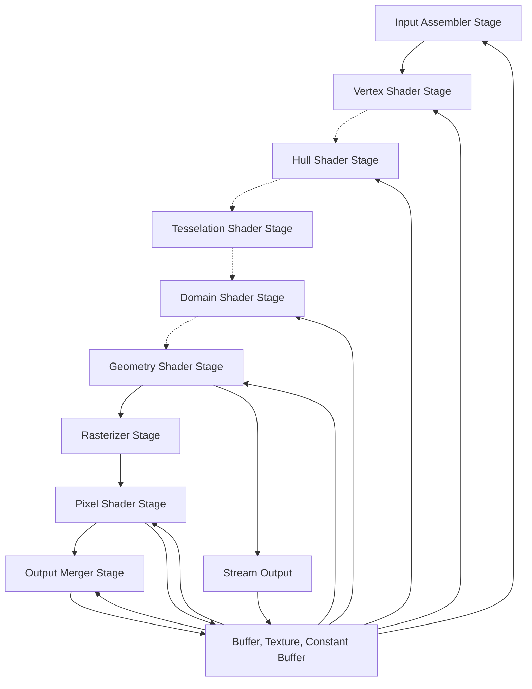

# Hello Triangle

In the last chapter we initialized core components of `D3D11` and DXGI such as the Device and the SwapChain, but simply clearing the Window with some color is pretty boring.
This time we'll be drawing our first triangle with a nice froge-like color.

## The Pipeline
The fundamental part of all graphic APIs is the "Graphics Pipeline", whether we're drawing a single triangle, a textured frog or the whole Elden Ring map, everything goes through the pipeline; it is a series of functions that are either hardwired in hardware, configurable or fully programmable, and all it does is transform all that we draw from 3D space to the 2D space that is our monitor. All the steps in the graphics pipeline go from top to bottom and are shown below.


As you can see, each stage in the pipeline takes in the previous stage's output as the input, the rectangle blocks are pipeline stages that are not programmable but are configurable, while the rounded rectangle blocks are stages that are fully programmable.
To draw most of the things throughout this series we'll mostly need these stages: Input Assembler, Vertex Shader and the Pixel Shader, Output Merger.

The Vertex and Pixel shaders are fully programmable and we'll write a very basic program for them.

The other two stages are not programmable but they are fairly easy to understand and configure, the **Input Assembler** is responsible for processing the vertices in an eventual vertex buffer into the primitive of our choice, which is of course, triangles in our case, and sending this processed output to the Vertex Shader. The **Output Merger** instead is responsible for combining the values written by the pixel shader, may that be depth, color or other things, into the one or more render targets that we provide to the OM, we only have one render target for now.

### Vertex Shader
The **Vertex Shader** is the stage where our vertices are processed however we want, although we don't do much processing here, and in the end they're transformed to [screen-space coordinates](link to the coordinate system chapter?)

The vertices are usually read from a **Vertex Buffer** which are laid out in a particular way. The vertex shader will be run however many times we tell it to run, which is specified in the first parameter of `ID3D11DeviceContext::Draw()` (more on this later), for instance if we call `Draw(3, 0)`, the vertex shader will run 3 times.

Since we only want to draw a triangle, we don't need to do much processing, we can just provide the input vertices as the output.

The vertex buffer can be omitted, for example if we want to draw a full screen triangle, instead of creating a vertex buffer, for simplicity we can just hardcode the vertices in the vertex shader without having to bind a vertex buffer.

Let's look at our basic vertex shader for this section:
#### Main.vs.hlsl
```hlsl
struct VSInput
{
    float3 position: SV_Position;
    float3 color: COLOR0;
};

struct VSOutput
{
    float4 position: SV_Position;
    float3 color: COLOR0;
};

VSOutput Main(VSInput input)
{
    VSOutput output = (VSOutput)0;
    output.position = float4(input.position, 1.0);
    output.color = input.color;
    return output;
}
```
First off, we define 2 types, `VSInput` and `VSOutput` which represent obviously the vertex shader's input and output.

The input is 2, `float3` (vector of 3 float components), the first is the "position" field, which are coordinates ranging from [-1.0, 1.0], if the values are outside this range they are clipped, and we won't see them on screen.

The second is the "color" field, which we also pass as the output of this stage onto the pixel shader.

Notice how all our fields have a colon and some identifier attached to them, these are "semantics". 
Semantics that are preceded by `SV` are called "system-value semantics" and their meaning and usage is defined by D3D11. `SV_Position` for example means that the field `position` will be used by D3D11 as the actual output of the vertex shader. 
Everything else are "user defined semantics" and their naming is up to the shader author. These are used to pass userdata between shader stages.

Then we have our `VSOutput`, which has our vertices in the first field `position` and our color in the second field `color`.

Finally we have our main function, which takes in a single parameter which is our input in the form of `VSInput`, and returns our output in the form of a `VSOutput`. Since we don't do any processing, we simply make a new instance of `VSOutput`, initialize it all to 0 and forward our input position and color to the output.

### Pixel Shader
The **Pixel Shader** is the stage where we give the pixels on our render target color, it is invoked for each pixel that is covered by a triangle.

We use this stage to apply most of our shading techniques, from basic lighting, to textures and shadows, all the way to physically based rendering.

Since we did not specify any shader between the VS and the PS, our input here is the output of the VS, and the output is one or more render targets.

Let's look at our Pixel Shader now:
#### Main.ps.hlsl
```hlsl
struct PSInput
{
    float4 position: SV_Position;
    float3 color: COLOR0;
};

struct PSOutput
{
    float4 color: SV_Target0;
};

PSOutput Main(PSInput input)
{
    PSOutput output = (PSOutput)0;
    output.color = float4(input.color, 1.0);
    return output;
}
```
Here as well we have an input `PSInput`, and an output `PSOutput`.

Since there aren't any other shaders in between the VS and the PS, the VS's output is the PS's input, the naming might be a bit confusing but that's the gist of it, PSInput should match the VSOutput in vertex shader, this isn't entirely required but not doing so is only advisable if you really know what you are doing.

Next we have our output, `D3D11` gives us the possibility to write to multiple render targets, but we are not doing that, so we'll just be writing a `float4` as our output, which is an RGBA color.

Notice how we have another semantic string attached to the `color` field, this semantic string specifies which render target we want to be writing to, the `0` after `SV_Target` is the index of our render target, in our case, we have only one so we write `SV_Target0` or `SV_Target`.

`D3D11` lets us write up to 8 render targets simultaneously from the same pixel shader, those come in handy when implementing more advanced shading techniques, for example a popular technique that uses 4 or more 

And lastly, our `Main` function, following the same pattern as in the VS, we have one parameter, the input, and one return value, the output, again we create an instance of `PSOutput`, initialize everything to 0, and write the color we got from the input, to our output.
## Compiling shaders

Now that we wrote our shader code and saved it somewhere, we have to feed this to the GPU, to do that we'll have our D3DCompiler get to work.

First, we will declare some functions that will help us compile our shaders more quickly.

### HelloTriangle.hpp
```cpp
bool CompileShader(
    const std::wstring_view fileName,
    const std::string_view entryPoint,
    const std::string_view profile,
    ComPtr<ID3D10Blob>& shaderBlob) const;

[[nodiscard]] ComPtr<ID3D11VertexShader> CreateVertexShader(
    const std::wstring_view fileName,
    ComPtr<ID3D10Blob>& vertexShaderBlob) const;

[[nodiscard]] ComPtr<ID3D11PixelShader> CreatePixelShader(std::wstring_view fileName) const;
```
In order we have:

`CompileShader`: This function is the core for compiling shaders, it requires 3 input parameters:

- `fileName`: is the path of the shader file we want to compile.
- `entryPoint`: is the name of the function where the shader begins execution.
- `profile`: which is basically the version of HLSL we want to use, the higher the profile number, the more features there are.

And one output parameter:

- `shaderBlob`: the blob were our compiled code will be stored. A blob is just a fancy buffer which `D3D11` can use for specific purposes.

Then:
`CreateVertexShader`: This function helps us create specifically a `ID3D11VertexShader`, it only requires the shader path and a `ID3D10Blob`. We need to pass a blob ourselves because we'll need the VS's blob later.

`CreatePixelShader`: It does the same thing that `CreateVertexShader` does, except we don't need to pass a `ID3D10Blob` here.

Now that we know how our new members look, we will see how we implemented them.
### HelloTriangle.cpp
First things first, let's see `CompileShader`:
#### CompileShader
```cpp
bool HelloTriangleApplication::CompileShader(
    const std::wstring_view fileName,
    const std::string_view entryPoint,
    const std::string_view profile,
    ComPtr<ID3D10Blob>& shaderBlob) const
{
    constexpr UINT compileFlags = D3DCOMPILE_ENABLE_STRICTNESS;

    ComPtr<ID3D10Blob> tempShaderBlob = nullptr;
    ComPtr<ID3D10Blob> errorBlob = nullptr;
    if (FAILED(D3DCompileFromFile(
        fileName.data(),
        nullptr,
        D3D_COMPILE_STANDARD_FILE_INCLUDE,
        entryPoint.data(),
        profile.data(),
        compileFlags,
        0,
        &tempShaderBlob,
        &errorBlob)))
    {
        std::cout << "D3D11: Failed to read shader from file\n";
        if (errorBlob != nullptr)
        {
            std::cout << "D3D11: With message: " << static_cast<const char*>(errorBlob->GetBufferPointer()) << "\n";
        }

        return false;
    }

    shaderBlob = std::move(tempShaderBlob);
    return true;
}
```

We start by creating two `ID3D10Blob`s, we will need a temporary blob, where we'll load our shader file and an error blob, which will contain our error messages, if any.

Then we call for `D3DCompileFromFile`, it requires quite a lot of parameters so let's go over them one by one in order:

- `pFileName`: a UTF-8 string containing the file name of the shader we want to compile.
- `pDefines`: optional, basically an array of macros that we want to define.
- `pInclude`: optional, a pointer to a `ID3DInclude` object, it is useful to specify how to handle `#include` directives in shaders. It is common to just use `D3D_COMPILE_STANDARD_FILE_INCLUDE`, which is the default handler.
- `pEntrypoint`: a string containing the name of the main function in the shader.
- `pTarget`: a string containing the Shader Model version to use for this shader.
- `Flags1`: the flags that changes how to compile our shaders, for example we pass `D3DCOMPILE_ENABLE_STRICTNESS` which makes the compiler stricter in judging our code and disables legacy syntax support. 
- `Flags2`: ignored, set to 0.
- `ppCode`: output, a pointer to a `ID3D10Blob*`, this is where our compiled code will be stored.
- `ppErrorMsgs`: optional, output, a pointer to a `ID3D10Blob*`, this is where the D3D compiler will store our errors, `nullptr` if everything went fine.

Then we do our usual checking, if there were errors, leave the output blob as is and print the error message contained in the blob. Otherwise, move the blob to our output parameter.

Now let's see `CreateVertexShader` and `CreatePixelShader`:

#### CreateVertexShader
```cpp
HelloTriangleApplication::ComPtr<ID3D11VertexShader> HelloTriangleApplication::CreateVertexShader(
    const std::wstring_view fileName,
    ComPtr<ID3D10Blob>& vertexShaderBlob) const
{
    if (!CompileShader(fileName, "Main", "vs_5_0", vertexShaderBlob))
    {
        return nullptr;
    }

    ComPtr<ID3D11VertexShader> vertexShader;
    if (FAILED(_device->CreateVertexShader(
        vertexShaderBlob->GetBufferPointer(),
        vertexShaderBlob->GetBufferSize(),
        nullptr,
        &vertexShader)))
    {
        std::cout << "D3D11: Failed to compile vertex shader\n";
        return nullptr;
    }

    return vertexShader;
}
```

As you can see here we are using our helper function `CompileShader` to avoid repeating ourselves, we are specifying `"Main"` as the entry point of our vertex shader and `"vs_5_0"` as the Shader Model, which means "Vertex Shader Model 5.0".

After we get our blob successfully, we can create a vertex shader out of it with `ID3D11Device::CreateVertexShader`, it takes a pointer to a buffer with the compiled code and its size as the input. The resulting vertex shader is the last parameter which is our output.

And finally
#### CreatePixelShader

```cpp
HelloTriangleApplication::ComPtr<ID3D11PixelShader> HelloTriangleApplication::CreatePixelShader(const std::wstring_view fileName) const
{
    ComPtr<ID3D10Blob> pixelShaderBlob = nullptr;
    if (!CompileShader(fileName, "Main", "ps_5_0", pixelShaderBlob))
    {
        return nullptr;
    }

    ComPtr<ID3D11PixelShader> pixelShader;
    if (FAILED(_device->CreatePixelShader(
        pixelShaderBlob->GetBufferPointer(),
        pixelShaderBlob->GetBufferSize(),
        nullptr,
        &pixelShader)))
    {
        std::cout << "D3D11: Failed to compile pixel shader\n";
        return nullptr;
    }

    return pixelShader;
}
```
Pretty much the same thing as `CreateVertexShader`, the only thing that changes is the `profile` parameter, from `"vs_5_0"` to `"ps_5_0"`, since we're not compiling a vertex shader now, we have to change this to the "Pixel Shader Model 5.0".

After all of this, we can now call these functions, in `HelloTriangleApplication::Initialize()` you should now add:
#### Initialize
```cpp
ComPtr<ID3D10Blob> vertexShaderBlob = nullptr;
_vertexShader = CreateVertexShader(L"Assets/Shaders/Main.vs.hlsl", vertexShaderBlob);
if (_vertexShader == nullptr)
{
    return false;
}

_pixelShader = CreatePixelShader(L"Assets/Shaders/Main.ps.hlsl");
if (_pixelShader == nullptr)
{
    return false;
}
```

We still have a `vertexShaderBlob` now, it will be useful to us later, in creating an input layout.

### Input Layouts
We have successfully compiled our shaders now, we need one last thing, an **Input Layout**.
An input layout, is basically the format we want to lay our vertices in our buffers.

Since all our vertices we want to give to the GPU must be tightly packed in the same buffer, the Input Assembler needs a way to make sense of our data, this is exactly what an input layout is for.
Let's see what input we expect in the vertes shader:

```hlsl
struct VSInput
{
    float3 position: POSITION;
    float3 color: COLOR0;
};
```

The vertex shader expects 2 vectors of 3 components each, for each vertex. We should then create an input layout exactly with this format.

First of all, creating a `struct` in our C++ source with that maps to our `VSInput` as closely as possible will make our life easier.

To do this we'll use DirectXMath which has types that map perfectly to HLSL, both of our inputs are `float3` in HLSL, which means that this translates to `DirectX::XMFLOAT3`.

```cpp
using Position = DirectX::XMFLOAT3;
using Color = DirectX::XMFLOAT3;

struct VertexPositionColor
{
    Position position;
    Color color;
};
```

The type aliases help us make this more readable and more easily guess what is what, so obviously the first field is our position vector and the second field is our color vector.

Now we can create our **Input Layout Description** using an array of `D3D11_INPUT_ELEMENT_DESC`. You can think of each element in this array as describing one field in the `VSInput`.

```cpp
constexpr D3D11_INPUT_ELEMENT_DESC vertexInputLayoutInfo[] =
{
    {
        "POSITION",
        0,
        DXGI_FORMAT::DXGI_FORMAT_R32G32B32_FLOAT,
        0,
        offsetof(VertexPositionColor, position),
        D3D11_INPUT_CLASSIFICATION::D3D11_INPUT_PER_VERTEX_DATA,
        0
    },
    {
        "COLOR",
        0,
        DXGI_FORMAT::DXGI_FORMAT_R32G32B32_FLOAT,
        0,
        offsetof(VertexPositionColor, color),
        D3D11_INPUT_CLASSIFICATION::D3D11_INPUT_PER_VERTEX_DATA,
        0
    },
};
```

Now let's make sense of what each field means, let's go over one by one in order.

- `SemanticName`: let's us refer to a particular field given the string after the colon in HLSL (remember `float3 position: POSITION`)
- `SemanticIndex`: the index of each semantic, `POSITION` is equivalent to `POSITION0`, where the number at the end is our index, so we'll just pass in 0.
- `Format`: the format of this field, basically how many components there are and what type they are, a `float3` in HLSL is a vector of 3 floats, each float is 4 bytes wide (or 32 bits), so the format here is `DXGI_FORMAT_R32G32B32_FLOAT`.
- `InputSlot`: we'll see about this later.
- `AlignedByteOffset`: the offset of this field, in bytes; this is our first field so there is no offset, but the `COLOR` one for example, will have an offset of 12 bytes.
- `InputSlotClass`: The rate of input either per-vertex or per-instance, we don't care about instances right now so we'll set this to PER_VERTEX.
- `InstanceDataStepRate`: if `InputSlotClass` was PER_INSTANCE, this would mean how many instances should be drawn with the same data; this is 0 since we don't care about this.

Hopefully it makes a bit more sense now, all we have to do is create the input layout using this data:

```cpp
if (FAILED(_device->CreateInputLayout(
    vertexInputLayoutInfo,
    _countof(vertexInputLayoutInfo),
    vertexShaderBlob->GetBufferPointer(),
    vertexShaderBlob->GetBufferSize(),
    &_vertexLayout)))
{
    std::cout << "D3D11: Failed to create default vertex input layout\n";
    return false;
}
```

As usual we follow the same pattern, we pass in our `vertexInputLayoutInfo` that we just created and its size, we also need to pass our vertex blob pointer and size, and finally our output parameter which is our input layout.

Now all we have to do is create a vertex buffer (don't worry it's really easy) and issue our first `Draw` command!

!!! error
    Image showing stride and offset?

## Vertex Buffers

Vertex Buffers might seem hard at first, but they're really nothing more than a buffer that resides in our device's memory, which means really fast access. This buffer will be then bound and read by the vertex shader.

Creating a vertex buffer is also really easy, first of all we have to make some data to put in our buffer, since we want to draw a triangle, we will be creating 3 vertices using our `VertexPositionColor` struct.

```cpp
constexpr VertexPositionColor vertices[] =
{
    { Position{  0.0f,  0.5f, 0.0f }, Color{ 0.25f, 0.39f, 0.19f } },
    { Position{  0.5f, -0.5f, 0.0f }, Color{ 0.44f, 0.75f, 0.35f } },
    { Position{ -0.5f, -0.5f, 0.0f }, Color{ 0.38f, 0.55f, 0.20f } },
};
```

There we go, remember, the position coordinates we have to give to the vertex shader must be in range [-1.0, 1.0], otherwise we won't be able to see that vertex. We are storing these coordinates that form a triangle here, we're also storing a color for each vertex, since they will be interpolated by our pixel shader.

If you want you can try to visualize the triangle, take a piece of paper, draw a **Cartesian Plane**, draw 3 points and connect the dots with these coordinates.

Now that we have the data, let's store this on our vertex buffer:

```cpp
D3D11_BUFFER_DESC bufferInfo = {};
bufferInfo.ByteWidth = sizeof(vertices);
bufferInfo.Usage = D3D11_USAGE::D3D11_USAGE_IMMUTABLE;
bufferInfo.BindFlags = D3D11_BIND_FLAG::D3D11_BIND_VERTEX_BUFFER;
D3D11_SUBRESOURCE_DATA resourceData = {};
resourceData.pSysMem = vertices;
if (FAILED(_device->CreateBuffer(
    &bufferInfo,
    &resourceData,
    &_triangleVertices)))
{
    std::cout << "D3D11: Failed to create triangle vertex buffer\n";
    return false;
}
```

We begin by filling a `bufferInfo` descriptor for our buffer, we specify how many bytes we want, since this buffer will never change, for the `Usage` we specify: `D3D11_USAGE_IMMUTABLE`, this lets `D3D11` put this data a close as possible to the GPU, finally we specify how we want to use this buffer, we want this to be a vertex buffer, so for the `BindFlags` we give: `D3D11_BIND_VERTEX_BUFFER`.

And finally we create a `resourceData`, and populate the only field we care about: `pSysMem`, which is a pointer to our vertices which are currently in system RAM.

Then we issue the creation of the buffer using `CreateBuffer`, using the informations we collected until now.

## Drawing our triangle

Finally we have reached the moment of truth, in our `Render` function we will add a few things:

```cpp
_deviceContext->IASetInputLayout(_vertexLayout.Get());
```

This sets the input layout we want to use.

```cpp
_deviceContext->IASetVertexBuffers(
    0,
    1,
    _triangleVertices.GetAddressOf(),
    &vertexStride,
    &vertexOffset);
```

Then we go ahead and bind our vertex buffer.

```cpp
_deviceContext->IASetPrimitiveTopology(D3D11_PRIMITIVE_TOPOLOGY::D3D11_PRIMITIVE_TOPOLOGY_TRIANGLELIST);
```

This sets how the Input Assembler should interpret the vertex data, since we want to draw triangles, `D3D11_PRIMITIVE_TOPOLOGY_TRIANGLELIST` is the right flag for us.

```cpp
_deviceContext->VSSetShader(
    _vertexShader.Get(),
    nullptr,
    0);
_deviceContext->PSSetShader(
    _pixelShader.Get(),
    nullptr,
    0);
```

Setting the vertex and pixel shader here. I suggest to put `PSSetShader` after `RSSetViewports`, since it will maintain the pipeline order, it doesn't have any performance or correctness implications, it will just help you remember better which stage comes after which.

```cpp
_deviceContext->Draw(3, 0);
```

And finally, tell the GPU to draw 3 vertices, this will invoke the vertex shader 3 times, and it will successfully process the 3 vertices we put in our vertex buffer.
You should now be able to run this and see your first triangle!

!!! error
    Fix this graph madness



```
    [*] --> IA
    IA[Input Assembler Stage] --> VS[Vertex Shader Stage]
    VS -.-> HS[Hull Shader Stage]
    HS[Hull Shader Stage] -.-> TS[Tesselation Shader Stage]
    TS -.-> DS[Domain Shader Stage]
    DS -.-> GS[Geometry Shader Stage]
    GS --> RS[Rasterizer Stage]
    GS --> SO[Stream Output]
    RS --> PS[Pixel Shader Stage]
    PS --> OM[Output Merger Stage]

    MR[Buffer, Texture, Constant Buffer] --> IA
    MR-->VS
    MR-->HS
    MR-->DS
    MR-->GS

    MR-->PS
    PS-->MR
    MR-->OM
    OM-->MR

    SO-->MR
    SO --> [*]
```




