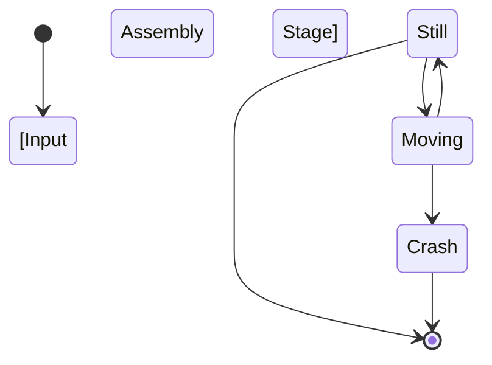
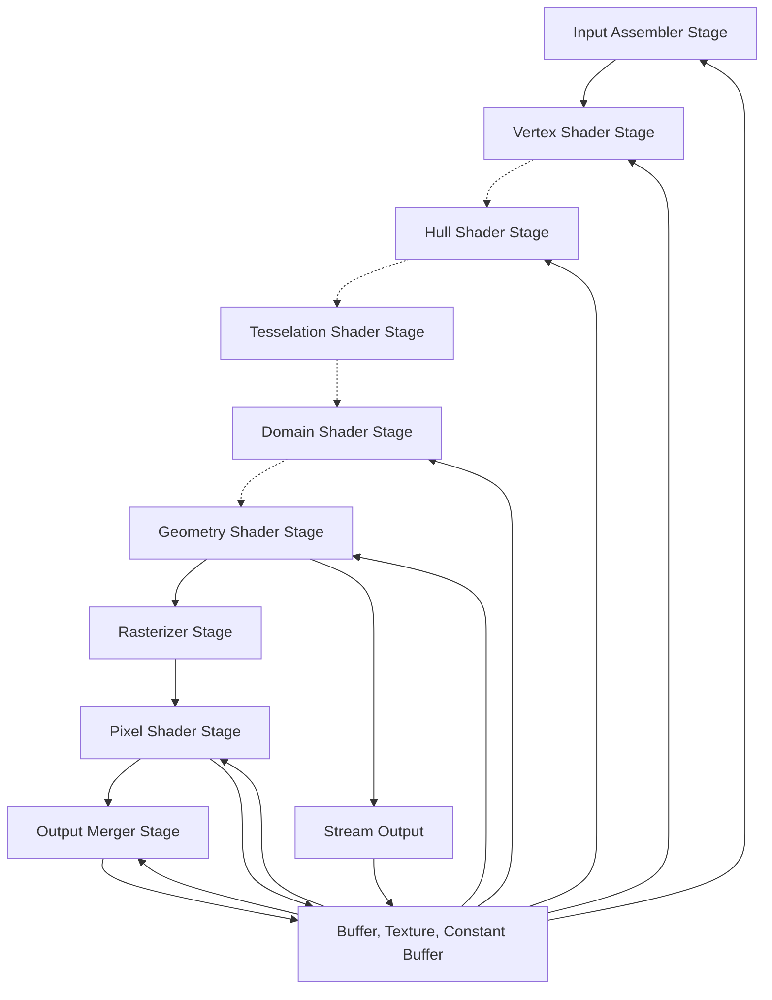

# Hello Triangle

## Graphics Pipeline

!!! error "explain in an overview fashion with pics what directx pipeline is"

    how it roughly works and what it means and can do




```
    [*] --> IA
    IA[Input Assembler Stage] --> VS[Vertex Shader Stage]
    VS -.-> HS[Hull Shader Stage]
    HS[Hull Shader Stage] -.-> TS[Tesselation Shader Stage]
    TS -.-> DS[Domain Shader Stage]
    DS -.-> GS[Geometry Shader Stage]
    GS --> RS[Rasterizer Stage]
    GS --> SO[Stream Output]
    RS --> PS[Pixel Shader Stage]
    PS --> OM[Output Merger Stage]

    MR[Buffer, Texture, Constant Buffer] --> IA
    MR-->VS
    MR-->HS
    MR-->DS
    MR-->GS

    MR-->PS
    PS-->MR
    MR-->OM
    OM-->MR

    SO-->MR
    SO --> [*]
```




