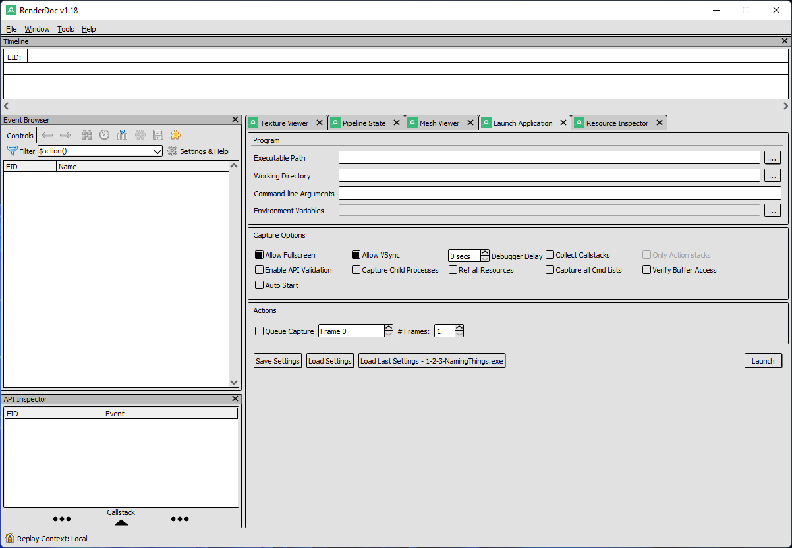
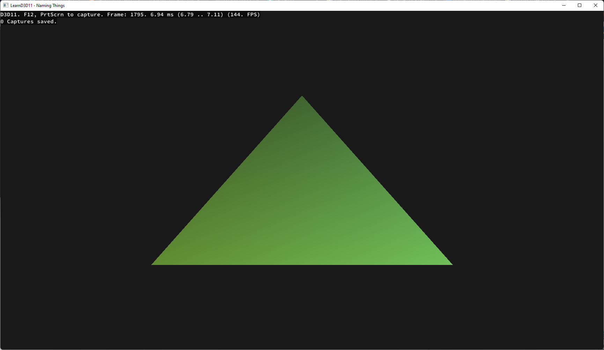
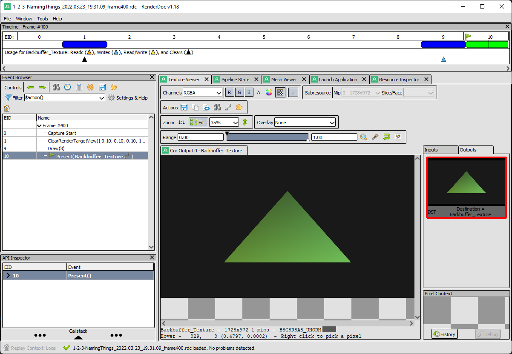
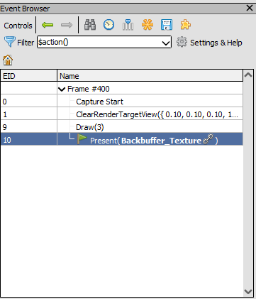

# RenderDoc

Typically while developing an application there will be complications that cannot be easily deduced by watching the program execute or by reading the code; in a situation like this one will use a debugger to monitor the state of the program to locate the bug, and this is no different for graphics programming. 

Graphics programmers will use what is called a "graphics debugger" when working with a graphics API to monitor API calls, pipeline state, data within the pipeline, etc. 

While there are multiple graphics debuggers provided by multiple vendors such as Nvidia's Nsight, AMD's Radeon Graphics Profiler (Does not directly support DX11), Intel's Graphics Performance Analyzers, and Microsoft's PIX, we will instead be using a cross-platform open-source option, RenderDoc.

To download RenderDoc, [click here](https://renderdoc.org/) and follow the instructions on the webpage.

Before getting into the details of Renderdoc, an executable is needed to display what the application is capable of. 

In the “Executable Path” navigate to the directory of the last section’s project and set it as the executable. Set the “Working Directory” to the directory where the asset and shader folders are kept.

RenderDoc can now be started by clicking the “Launch” button in the bottom right of the “Launch Application" tab. Upon launching the application it will have an overlay in the top left corner stating the active API, frame count, frame time, captures saved, and to press F12 to take a frame capture.

After a frame has been captured and the captured application is closed, return to RenderDoc.

The RenderDoc window is now fully populated, however for the sake of brevity only the “Event Browser”, “API Inspector”, “Pipeline State”, and “Resource Inspector” are of concern.

The event browser displays a generalization of the API calls called in the form of events, an event is one or more API calls that have been grouped together by relation. 

There is not much going on in this example, but it can be helpful when debugging scenes making hundreds or even thousands of draws and dispatches a frame.

The API Inspector displays the contents of an event by listing out the API calls that it contains. For example, all the calls made to set the state for the draw call are grouped together under an event called “Draw”.

The Pipeline State tab displays the state of each active pipeline stage in addition to bound resources for the currently selected event. 

In this instance, the hull, domain, and geometry shader stages are grayed out because they were not used for that draw. 

The compute shader stage is called with its own dispatch commands and therefore is never active with the other stages; it is not a part of the rasterization pipeline.

The Resource Inspector presents a list of all the resources used to render the frame on the right side of the window with information pertaining to its usage within the frame, related resources, and the functions used to initialize the resource. 

To learn more about RenderDoc, [click here](https://renderdoc.org/docs/index.html) for its documentation.
